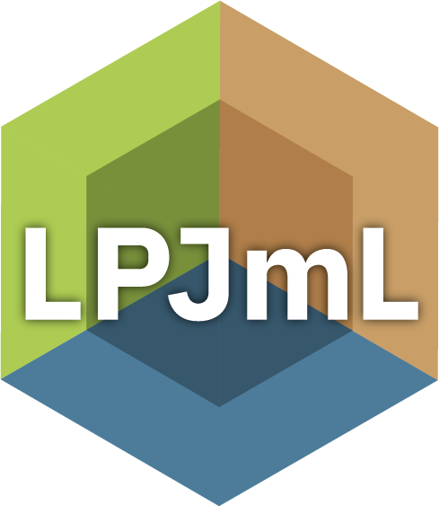

# <a href=''></a> Lund-Potsdam-Jena managed Land (LPJmL)


LPJmL is a **Dynamic Global Vegetation Model (DGVM)** written in **C**, designed to simulate terrestrial vegetation, hydrology, and carbon cycles at global scales.
Developed and maintained by the **Potsdam Institute for Climate Impact Research (PIK)** in Potsdam, Germany, LPJmL has been widely used in climate impact research.


## About LPJmL

LPJmL simulates the dynamics of terrestrial ecosystems, focusing on:
- Vegetation structure and function.
- Land-use and water management impacts.
- Carbon, water, and energy cycles under changing climate conditions.

For detailed functionality and scientific background, refer to the model documentation.


## Features

- **Dynamic Vegetation Modeling**: Simulates interactions between climate, vegetation, and biogeochemical processes.
- **Land-Use Integration**: Accounts for human land-use impacts and irrigation.
- **Flexible Configuration**: Highly configurable through input files and parameters.
- **Scalability**: Designed for global-scale simulations, with support for parallel computation.


## Getting Started

### Dependencies

LPJmL is written in **C** and requires the following tools and libraries:
- A standard **C compiler** (e.g., GCC or Clang).
- **GNU Make** for build management.
- [MPI](https://www.mpi-forum.org/) (optional, for parallel execution).
- [JSON-C library](https://github.com/json-c/json-c).
- NetCDF and Udunits-2 library (optional).

For additional dependencies, refer to the [INSTALL](./INSTALL) file.

### Setup & Usage

1. Clone the repository:
   ```bash
   git clone https://github.com/PIK-LPJmL/LPJmL.git
   cd LPJmL
   ```

2. Compile the source code:
   ```bash
    ./configure.sh
    make all
    ```
For detailed setup instructions, see the [INSTALL](./INSTALL) file.
LPJmL requires additional input data to run simulations. Input files can
be generated applying the [Land Input Generator (LandInG)](https://github.com/PIK-LPJmL/LandInG)
To test the model, use the provided test data:

3. Run a test simulation:

   ```bash
    ./lpjml --test
    ```

For detailed usage instructions, refer to the [documentation](./man).


## Contributing
We welcome contributions to LPJmL, including:

* Bug fixes.
* New model features.
* Improvements to documentation or performance.

### How to Contribute
1. Fork the repository on GitHub.
2. Create a feature branch:
    ```bash
    git checkout -b feature-name
    ```
3. Submit a pull request with a detailed description of your changes.

### Coding Standards
Please adhere to LPJmL’s coding standards. Refer to the [STYLESHEET.md](./STYLESHEET.md) for guidelines.

## Support Policy
Outside of collaborative agreements with PIK:

* **No official support** is provided for model setup, usage, or development.
* **Discussions** on development features can be initiated via GitHub Issues.

## License
LPJmL is open-source software licensed under the GNU Affero General Public License Version 3 (AGPLv3).
See the [LICENSE](./LICENSE) file for details.

## Acknowledgments
LPJmL is the result of collaborative work. See the [AUTHORS](./AUTHORS) file for contributors.
For scientific use of LPJmL, please cite the relevant publications listed in the [REFERENCES](./REFERENCES) file.

## Links and Resources
* [GitHub Repository](https://github.com/PIK-LPJmL/LPJmL)
* [Zenodo Distribution](https://doi.org/10.5281/zenodo.3497212)
* [Potsdam Institute for Climate Impact Research (PIK)](https://www.pik-potsdam.de/en/institute/departments/activities/biosphere-water-modelling/lpjml)
